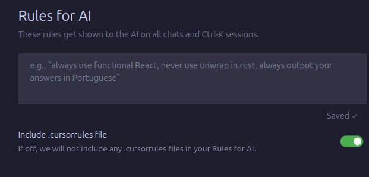
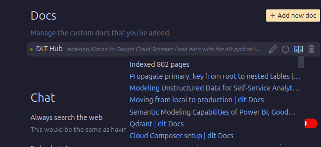
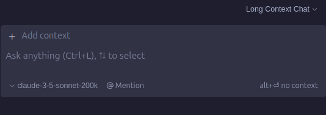
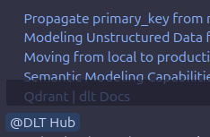
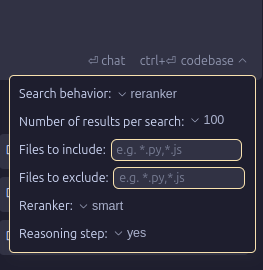
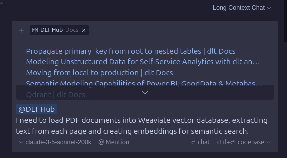
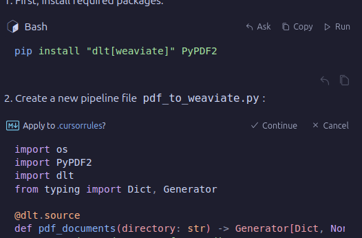
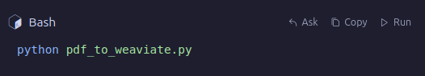
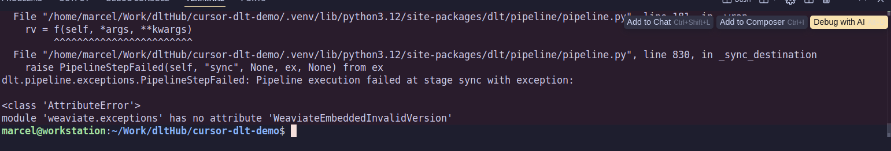

### Steps to Enable a Great dlt+cursor Development Experience

1. Set your "rules for ai" to use the accompanyijng `.cursorfiles`: 

2. Index the dlt documentation:

2. Enable [ long context chat ]( https://docs.cursor.com/chat/overview#long-context-chat-beta ), which uses Claude 200k, so you can use most of dlt codebase and documentation as context:

3. Add the dlt docs to the knowleadge base with the [@Docs](https://docs.cursor.com/context/@-symbols/@-docs) symbol:

4. Cursor.ai's embeddings search works on small codebases, but given the complexity of dlt code, it's better to use the `@codebase` command to rerank and reason more about the best answer. This will consume credits though. Be sure to select **Reranker as "smart"** and **Reasoning step as "yes"**.  

5. Describe *in detail* in the [chat modal](https://docs.cursor.com/chat/overview) `Cmd L` what you would like to accomplish. Be sure to set the modes as described above. Finally send the RAG pipeline to run with by hitting `ctrl+⏎` (Full codebase scan + super smart reranker + reasoning). :

6. Once the LLM gives you steps enclosed in markdown blocks, cursor is smart enough to allow you to either directly run them or apply them to files. For you convenience, and super fast iteration, click on "Run" or "Apply" buttons: Just be sure to check that the correct file is being changed - by opening up the relevant file then clicking on "Apply".

7. You can even run the bash commands:
If the commands throw errors, no worries! Send them back to the chat sessions effortlessly by clicking on "Add to Chat" or "Debug with AI", depending on whether you want the full chat context or not to debug this feature. I'll recommend to use the "Debug with AI" first since it takes less credits and is better to catch small erros. Complex erroes:

8. If the pipeline works, great! If not, edit the problematic code pieces using the [inline AI chat](https://docs.cursor.com/cmdk/overview) `Cmd K`.